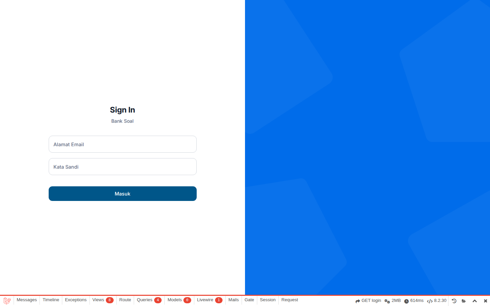
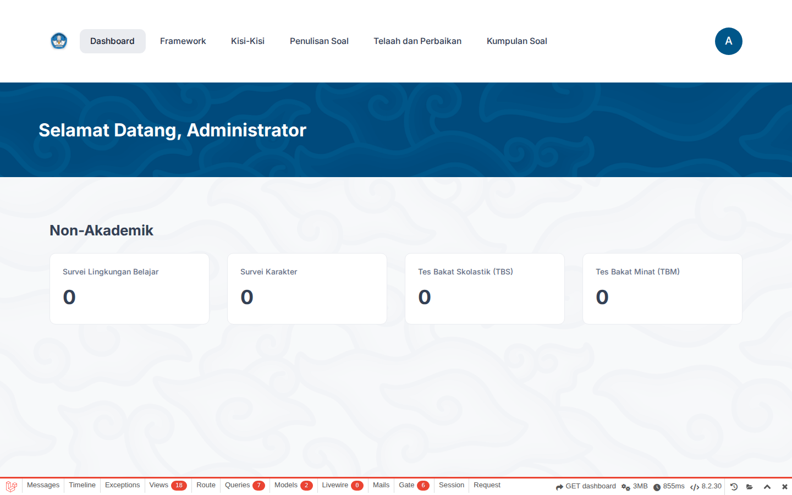
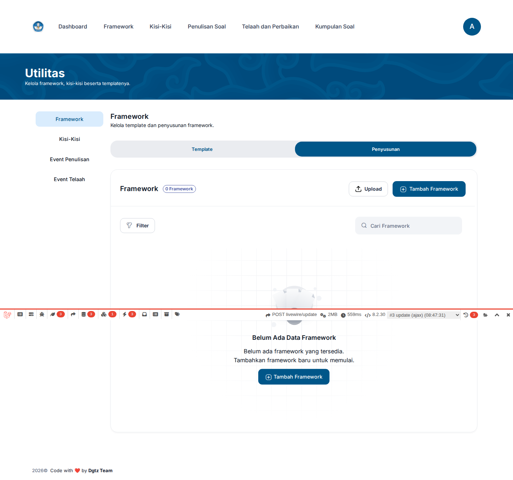
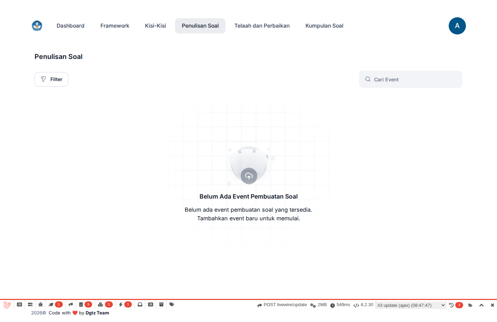
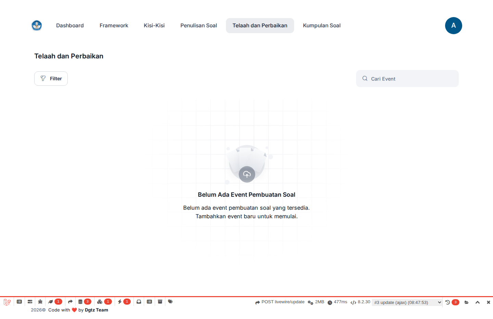
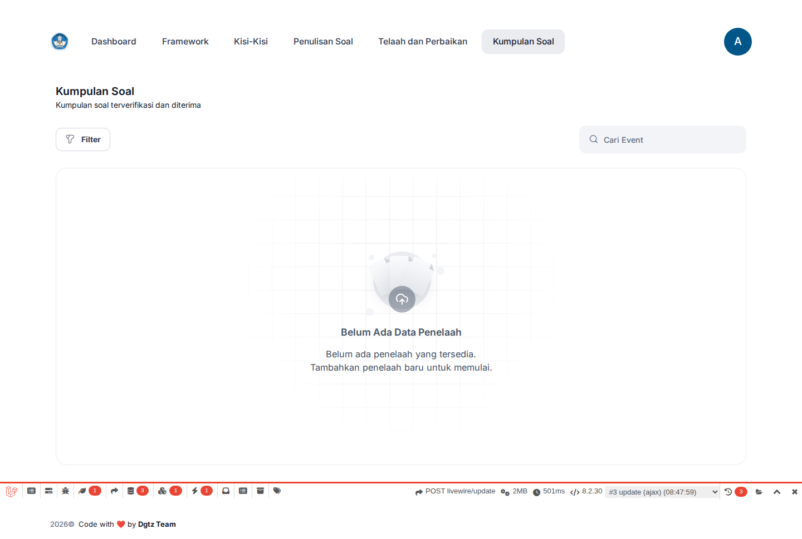

<div align="center">

# Bank Soal — National Exam Question Management Platform

**End-to-end collaborative platform for authoring, reviewing, and managing national examination questions — built for Indonesia's Ministry of Education (Kemendikbud).**

[](https://laravel.com)
[](https://livewire.laravel.com)
[](https://postgresql.org)
[](https://docker.com)
[](https://getbootstrap.com)

</div>

---

## The Problem

Indonesia's national exam question production involved **distributed educator teams** managing content through spreadsheets and email threads — with no audit trail, no enforced review workflow, and no centralized repository. Questions could skip review stages, reviewers had no visibility into revision history, and quality control was entirely manual.

## The Solution

A full-stack web platform that enforces a **multi-stage collaborative authoring pipeline** — from framework/outline definition through question writing, peer review, verification, and publication. Every action is audit-logged, access is role-controlled, and no question reaches students without passing through defined quality gates.

---

## Screenshots

<div align="center">

<p><em>Login — Clean, professional authentication interface</em></p>
</div>

<div align="center">

<p><em>Dashboard — Role-based overview with activity statistics</em></p>
</div>

<div align="center">

<p><em>Framework Preparation — Server-side data tables with filters and status tracking</em></p>
</div>

<div align="center">

<p><em>Question Writing — Event-based cards showing writing assignments with progress indicators</em></p>
</div>

<div align="center">

<p><em>Question Review — Review pipeline with status-based filtering</em></p>
</div>

<div align="center">

<p><em>Question Collection — Centralized repository of published questions</em></p>
</div>

---

## Key Features

### Multi-Stage Question Pipeline

```
Framework/Outline Definition → Question Writing → Peer Review → Verification → Publication
        (templates)                (authors)      (reviewers)   (verifiers)    (final)
```

Each stage enforces role-based access control. Questions cannot advance without passing defined quality gates. The entire lifecycle is tracked with audit logging.

### Hierarchical Tree Engine

Educational frameworks and outlines use **N-level hierarchical tree structures** — arbitrary-depth taxonomies where each node can have unlimited children. The tree engine supports:

- Dynamic depth — no hardcoded level limitations
- Real-time UI rendering via recursive Livewire components
- Excel import/export with automatic hierarchical row flattening
- Tree codes (`parent_code` / `tree_code`) for efficient traversal

### Dynamic Excel Template Engine

Bulk question authoring through Excel import/export where the **template structure adapts dynamically** based on the user-defined framework:

- Column headers auto-generated from template definitions
- Hierarchical data flattened into rows with parent context
- Multiple question types supported (MCQ, complex MCQ, situational judgment)
- Export preserves the tree hierarchy for round-trip editing

### Event-Based Exam Workflows

Exam events organize the entire question lifecycle:

- **Writing events** — assign authors to specific outline sections with deadlines
- **Review events** — auto-linked to writing events, assign reviewers to evaluate
- **Verification events** — independent quality gate before publication
- Self-referencing event model — review events link back to their parent writing event

### Role-Based Access Control

8 distinct roles with granular permissions:

`Super Admin` → `Administrator` → `Teacher` → `Lecturer` → `Person in Charge` → `Reviewer` → `Verifier` → `User`

Each role sees a scoped dashboard and can only access features within their permission set.

---

## Architecture

```
┌──────────────────────────────────────────────────────────┐
│                    Browser                                │
│         Livewire 3 + Blade + Bootstrap 5.3               │
│              (Keen Themes Metronic UI)                    │
├──────────────────────────────────────────────────────────┤
│                 Laravel 11                                │
│  ┌─────────┐ ┌──────────────┐ ┌───────────────────────┐ │
│  │Controllers│ │Livewire Comp.│ │   DataTables (yajra)  │ │
│  └────┬─────┘ └──────┬───────┘ └───────────┬───────────┘ │
│       │               │                     │             │
│  ┌────▼───────────────▼─────────────────────▼───────────┐ │
│  │              Eloquent ORM + Custom Traits             │ │
│  │    CascadeSoftDeletes │ GenUid │ FileUpload          │ │
│  └───────────────────────┬─────────────────────────────┘ │
├──────────────────────────┼───────────────────────────────┤
│                   PostgreSQL 15                           │
│  Session │ Cache │ Queue │ Audit Log │ Application Data   │
└──────────────────────────────────────────────────────────┘
```

**Production deployment:** FrankenPHP (Caddy-based) behind Nginx reverse proxy, containerized with Docker.

---

## Tech Stack

| Layer | Technology |
|-------|-----------|
| Backend | Laravel 11, PHP 8.3 |
| Frontend | Livewire 3, Blade, Bootstrap 5.3 (Keen Themes Metronic) |
| Database | PostgreSQL 15 |
| Runtime | FrankenPHP (production), Artisan Serve (development) |
| Assets | Vite, CKEditor 5 (rich text), DataTables |
| Auth & RBAC | Laravel Breeze, Spatie Permission |
| Audit | Spatie Activity Log |
| Exports | dompdf (PDF), Maatwebsite Excel |
| Containerization | Docker, Docker Compose |

---

## Author

**mavolty** — [github.com/mavolty](https://github.com/mavolty)

Built as a full-stack developer for Indonesia's Ministry of Education (Kemendikbud).
